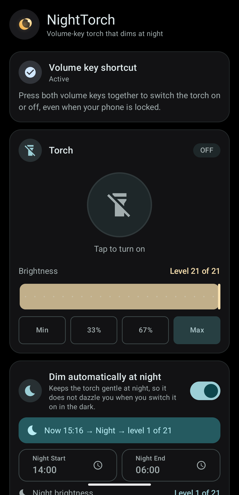
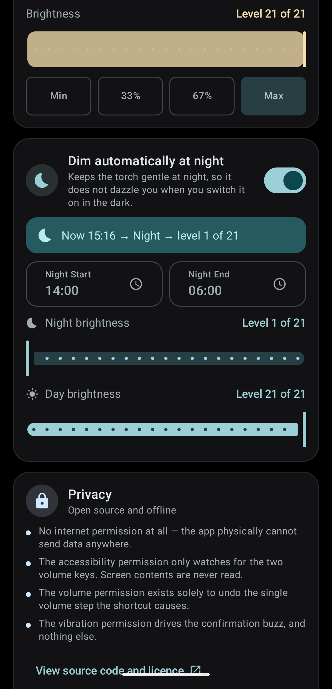
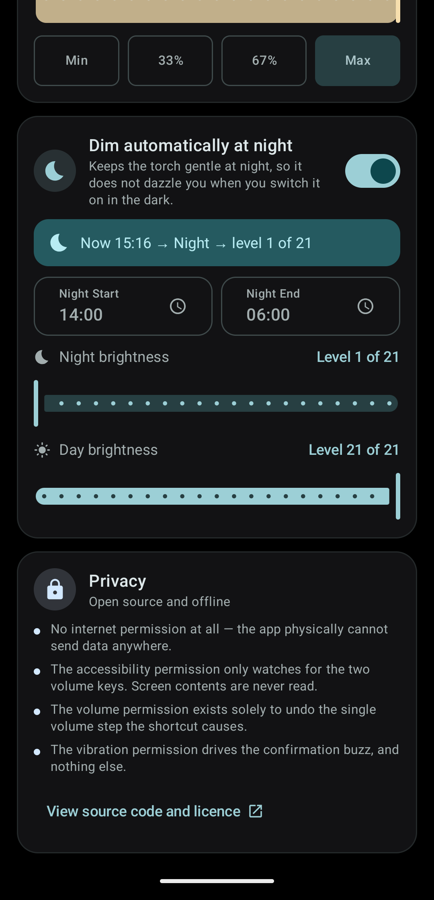

# NightTorch

A torch you can switch on without looking at your phone — and that doesn't blind you at 3am.

Press **both volume keys together** to toggle the torch, with the screen off and the phone
locked. At night it comes on dim; during the day it comes on bright. You choose the hours.

[](LICENSE)


<p align="center">
  
  
  
</p>

## Why it exists

Every torch app can turn the light on. The awkward part is reaching it: unlock the phone,
find the app or the Quick Settings tile, aim for a button — all while holding something in
your other hand, or standing in the dark, or half asleep.

NightTorch fixes the reaching, and then fixes the second problem nobody designs for: a torch
at full power at 3am is genuinely painful. It comes on at the lowest usable level between
your chosen night hours, and at full brightness the rest of the time.

## Features

- **Volume-key shortcut.** Both keys together toggles the torch, screen off and locked.
  Single presses still change the volume exactly as normal.
- **Time-aware brightness.** Dim at night, bright by day, with the hours under your control.
  Night defaults to 21:00–06:00 at the lowest level your hardware supports.
- **Real brightness levels.** The slider snaps to the levels your device actually has, so
  every position you can reach is a brightness you can see.
- **Volume restored.** The first key of the combo unavoidably reaches the system, so the app
  puts the volume back where it was.
- **Haptic confirmation.** A short buzz tells you the gesture registered — which matters
  when you are not looking at the screen.
- **No internet permission.** Not a promise; a fact you can check.

## Permissions

Three, and each is listed in the app's own Privacy card as well as here.

| Permission | Why |
|---|---|
| `BIND_ACCESSIBILITY_SERVICE` | The only way any Android app can see the volume keys while the phone is locked or another app is open. NightTorch requests key filtering **only** — it does not request permission to read screen content. |
| `MODIFY_AUDIO_SETTINGS` | To undo the single volume step the shortcut causes. Install-time, no prompt. |
| `VIBRATE` | The confirmation buzz, and nothing else. Install-time, no prompt. |

Deliberately **absent**:

- **`INTERNET`** — the app cannot transmit anything, anywhere. Check it yourself under
  *Settings → Apps → NightTorch → Permissions*, or read the
  [manifest](app/src/main/AndroidManifest.xml). CI fails the build if it ever appears.
- **`CAMERA`** — controlling the torch needs no camera permission. `setTorchMode` and
  `turnOnTorchWithStrengthLevel` sit outside the camera permission model on purpose.

### About the accessibility permission

When you enable the service, Android shows a warning saying NightTorch wants to "view and
control your screen". **That warning is identical for every accessibility service** and
cannot be customised by the app.

What NightTorch actually declares is `canRequestFilterKeyEvents` — key events only. It
requests no screen-content capability, `onAccessibilityEvent` is empty, and the whole
service is about 200 lines you can read
[here](app/src/main/java/com/bordware/nighttorch/service/FlashlightAccessibilityService.kt).

## Device compatibility

| Requirement | Detail |
|---|---|
| Android 8.0+ | minSdk 26 |
| Variable brightness | Android 13+ **and** hardware that reports more than one flash level |
| Binary on/off | Everything else — the UI says so rather than showing a dead slider |

Variable brightness is not implied by the Android version: plenty of devices on Android 13+
report a maximum flash level of 1, and NightTorch treats those as on/off only.

Measured devices are recorded in [docs/device-matrix.md](docs/device-matrix.md).

| Device | Android | Levels | Screen-off keys |
|---|---|---|---|
| Pixel 10 Pro | 17 | 21 | Yes |

Screen-off key delivery is the most manufacturer-dependent part of the design. If the
shortcut does not work on your device with the screen off, please open an issue with the
model and Android version — that table is how it gets more useful.

## Building

```bash
git clone https://github.com/bordware/NightTorch.git
cd NightTorch
./gradlew assembleDebug
```

Requires JDK 17 and the Android SDK for API 37. Everything else is pinned in
`gradle/libs.versions.toml`.

```bash
./gradlew test      # 92 JVM tests
./gradlew lint
./gradlew connectedDebugAndroidTest   # 29 tests; needs a device, unlocked and awake
```

The instrumented tests drive the real torch, so it flashes during the run.

## Privacy

The short version: NightTorch collects nothing, stores nothing off-device, and cannot send
anything anywhere. Your settings live in a local file, in app-private storage.

The longer version, including what the accessibility service can and cannot see, is in
[PRIVACY.md](PRIVACY.md).

## How it works

[docs/architecture.md](docs/architecture.md) explains the design and, more usefully, why the
awkward parts are the way they are — the volume-key consumption problem, why a key's release
must be passed through if its press was, and why variable brightness cannot be inferred from
the Android version.

## Contributing

See [CONTRIBUTING.md](CONTRIBUTING.md). Device reports for the compatibility table are
especially welcome — particularly non-Pixel hardware, where screen-off key delivery is
unverified.

## Licence

[GPL-3.0](LICENSE). Derivatives must stay open, which is the point: the privacy claims here
are checkable, and copyleft keeps them checkable downstream.

Inspired by [FlashDim](https://github.com/cyb3rko/flashdim), which pioneered the volume-key
approach. No code was copied from it.
